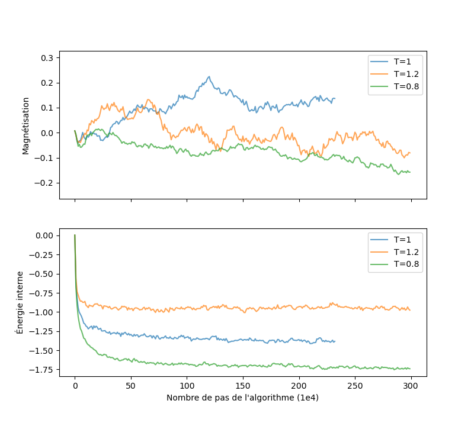
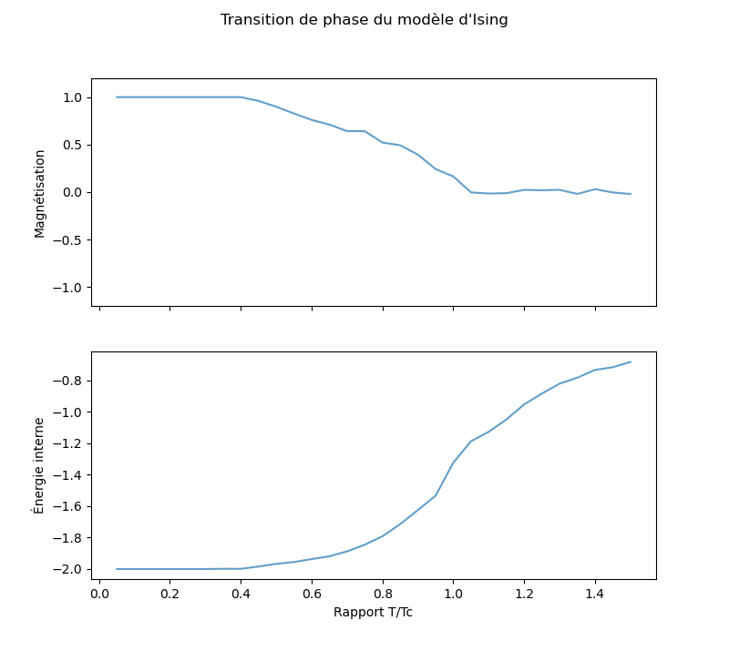
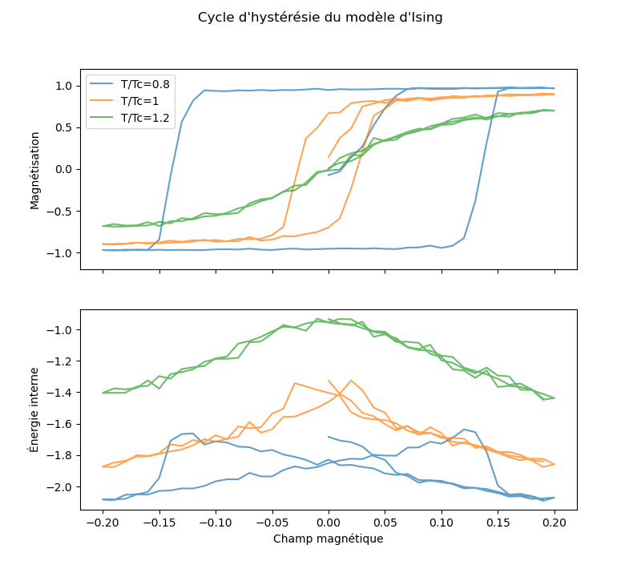

# Modèle d'Ising, méthode de Monte Carlo.

Ce projet a été réalisé dans le cadre du cours d'informatique avancée du M1 magistère de physique fondamental de Paris Saclay. L'objectif est de simuler un système de spin 2D couplés en utilisant le modèle d'Ising et la méthode numérique de Monte Carlo. 

## Le modèle physique

On considère un réseau carré de spin $\pm1$. Pour étudier ce système, on considère le modèle d'Ising avec une intéraction entre plus proches voisins : 

$\displaystyle H[S] = -\frac J2 \sum_{<i,j>}S_i S_j - B\sum_i S_i$

Où $J> 0$ est la force d'intération. Pour se simplifier la tache, on pose $J=1$. 

Bien sur, le système ne va pas avoir une énergie minimal à cause de la température. On va donc attribuer à chaque configuration physique une probabilité $P[S]\propto exp(-\beta H[S])$. Il est alors possible de montrer que pour $J=1$ il existe une température critique qui correspond à $\beta_c=\frac{ln(1+\sqrt2)}2$. 

L'objectif de ce projet est alors double. Le premier est de calculer la magnétisation $\displaystyle <M>=\sum_i S_i$ et l'énergie $E=<H>$ autour de la valeur critique. Le deuxième produire un cycle d'hystérésie satisfaisant.

## Le modèle numérique

Explorer tout l'espace des configurations serais beaucoup trop long. Il va donc falloir avoivoir recours à une autre méthode. Dans ce cas j'utilise l'algorithme de Metropolis. On commence par initialiser les spins de manière aléatoire. On vient ensuite répéter un certain nombre de fois les étapes suivantes : 

- On propose une nouvelle configuration de spin en tirant aléatoirement un site du réseau et en retournant le spin correspondant. 
- Ensuite, on calcul l'écart d'énergie entre les deux configurations.
- Si $\Delta E < 0$, on accepte la nouvelle configuration automatiquement. Si $\Delta E > 0$, on n'accepte la propostion que $exp(-\beta \Delta E)$ des fois. 

## L'implémentation

Dans un premier fichier, on crée les classes site et reseau. Ces classes permettent de manipuler un tableau 1D comme un tableau 2D avec des conditions au limites périodiques (dans la méthode permettant de créer le site à partir de valeurs données, des modulo permettent de créer un système périodique). Il est aussi donner dans la classe réseau une méthode pour avoir les plus proches voisins d'un site, une autre pour l'affichade d'une configuration (utilisation de SFML pour un affichage en temps réel) et deux méthodes pour calculer les grandeurs physiques citée plus tot. 

Le reste de la simulation se passe dans le fichier main. Deux fonctions sont crées. Une pour tirer aléatoirement les spins et une autre pour faire les étapes de l'algorithme de Metropolis. Enfin, dans la fonction main, 3 versions sont données dans les différentes branches. 

- La branche main permet l'affichage en temps réel de l'évolution de l'algorithme et crée les fichiers permettant d'estimer le temps de convergence. 
- La branche observables contient le code pour produire l'évolution de la magnétisation et de l'énergie en fonction de la température (T pas $\beta$) à $B = 0$.
- La derniére branche, histérésie, permet de produire les cycles d'hystérésie. 

Dans les deux dernières branches, on part d'une extriomité de la courbe (température haute ou B=0) et on réutilise la configuration pour la valeur de T ou B précédente pour refaire la simulation. On réalise alors un certain nombre d'incrément ($\approx 1e5$) puis on fait la moyenne sur plusieur configuration avant de rentrer celle ci dans le fichier.

Dans chaque branche est fournie un petit code python permettant de faire l'affichage des résultats qui sont pour l'instant donné dans un fichier text.

Attention, le fichier créer à toujours le même nom, il faut modifier ce nom avant de relancer le code C++ avec une nouvelle valeur de T ou B.

## Les résultats

Pour les temps de convergence, on obtiens la figure suivante : 

On observe que le temps de convergence est plus long pour les températures basses (1e5 pas). En revanche, les systèmes à plus hautes températures sont moins stable ce à quoi on s'attendait.

Pour l'évolution de l'énergie, la courbe obtenue est la suivante : 

On observe bien un régime critique à la température prévue. Avec plus de point, la discontinuité serait moins marqué et plus autour de 1. Dans le cas simulé, la magnétisation est partie au dessus de 0 mais en reprosuisant la simulation plusieurs fois (trop long pour mon pc...), on alterne entre deux courbes un peu près symétrique par rapport à 0.

Enfin, on a les cycles d'hystérésie suivant pour 3 température : 

On observe bien le magnétisme rémanant une fois le matériaux magnétisé pour $T < T_c$ et le comportement paramagnétique pour $T>T_c$.

## Conclusion

J'ai trouvé ce projet très intéressant. Il m'a permis de mettre en place pour la première fois la programmation orientée objet en C++ sur un modèle classique qui est toujours surprenant à voir. ²

Les résultats sont cohérent avec les résultats analytique et expérimentaux. On retrouve bien la température critique donné par le modèle analytique et les cycles d'hystérésie expérimentaux. 

